# project_01_fintech

### `TEAM MEMBERS`

`Shelly, Rachel, Shubhra, Kevin`
---

- Category - Fintech for Real Estate
- Objective - Investing in Real Estate in NYC Boroughs as an investment strategy

---
### `DATA SOURCES`

- Attom API - Historical Sales Data 
- NYC Open Source - Data - GeoMapping, Zip to Neighborhood Mapping
- www.health.ny.gov - ZIP Code Definitions of New York City Neighborhoods
- Zillow - Historical Rent Data
---

## HISTORICAL TRENDS OF SALES AND RENT OF NYC BOROUGH

###### This graph shows  invetors what price range each borough falls into interms of average sale price
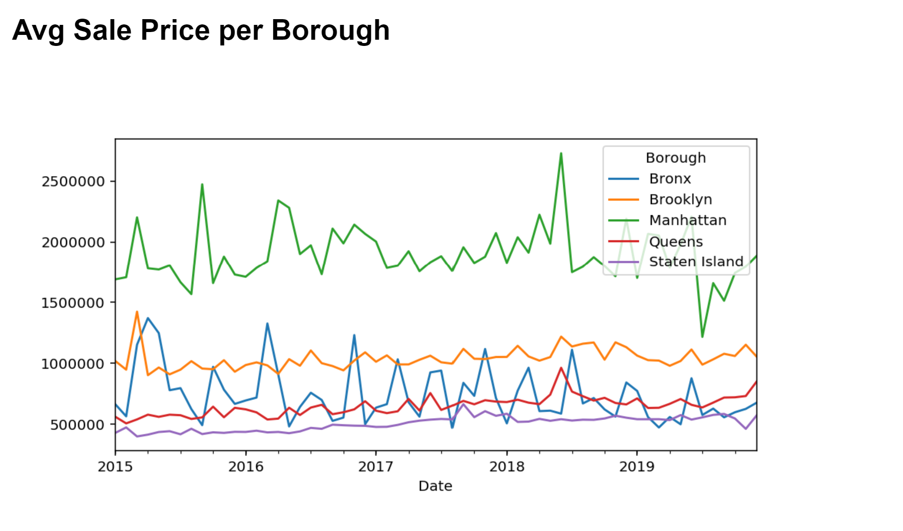
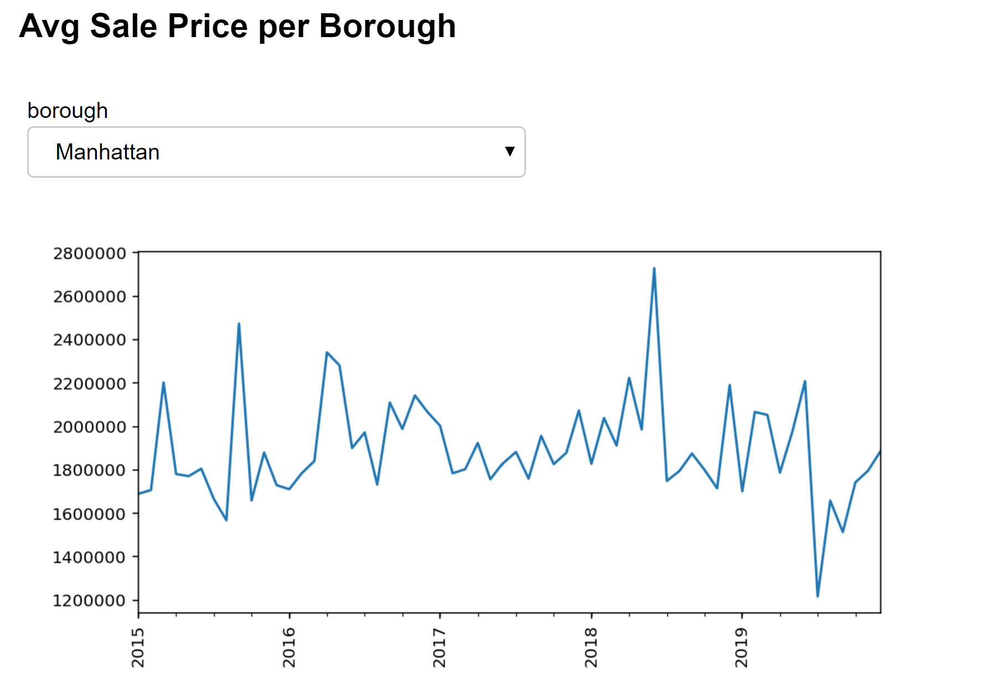
###### Rent per borough
- Looking at this the investor can see where they might get the best returns. Manhattan dominates the rental price market
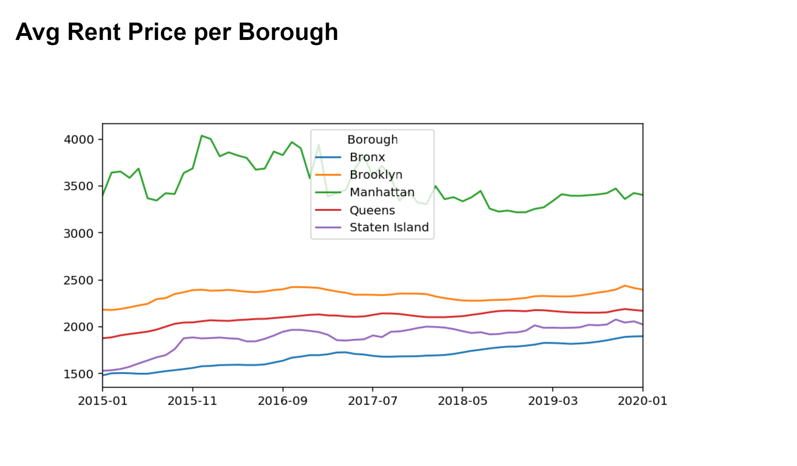
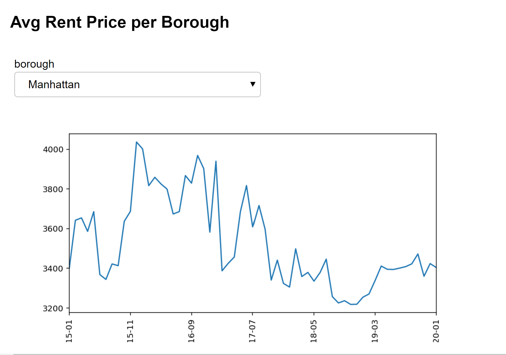

##### This data helps the investor understand if there is a correlation between the property prices of two boroughs so that if they want to invest in multiple properties they can divest their current property and get another asset which might be weakly or negatively correlated properties

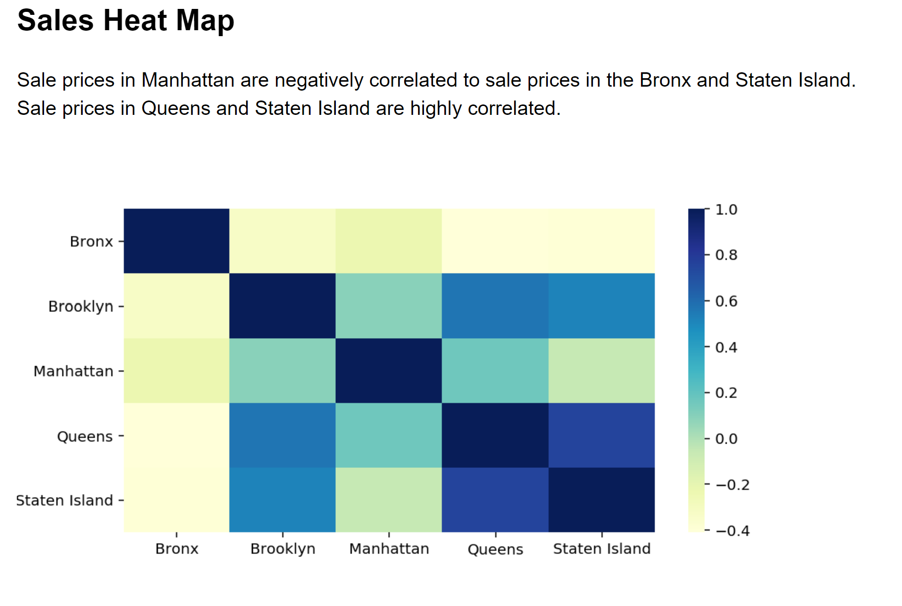
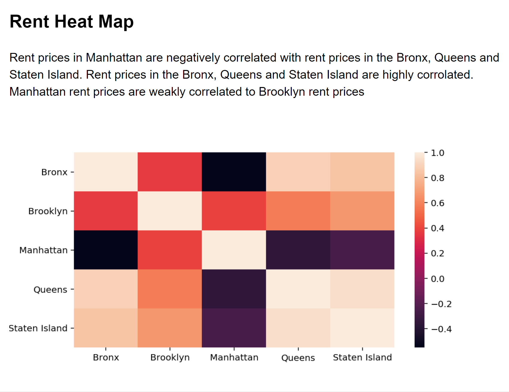
##### Quaterly trends
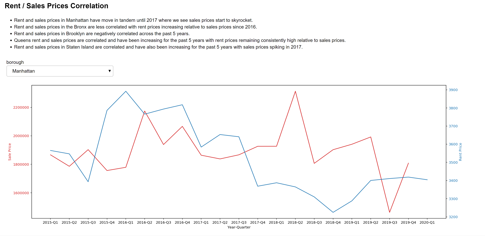

## `2019 TRENDS FOR INVESTORS TO FIND OPPORTUNITIES`
---

#### How to Calculate a Rental Property’s Return on Investment

##### Capitalization (cap) rate (ROI as refered to in the mapbox graph)

`In this project we didn't have to time to pull all the expenses so the ROI is just a demonstration of what we could do given more time.`

`If we had two more weeks we would have added additional inputs that investors typically use when modeling a real estate deal - Crime rate, school, demograpic trend, transportation data etc...`

###### This graph shows the investor the current years snapshot of Sales, Rent and ROI per zipcode

- Capitalization rate, also known as cap rate or ROI, refers to a property’s net income as a percentage of its market value. For the purposes of this calculation, the purchase price of the property is often used as its market value, especially if it was acquired within the past few years.

- Cap rate can be useful for a few reasons. For starters, it could be an apples-to-apples way to compare potential rental properties that may have different financing structures, since it doesn’t take debt repayment into account.

###### This graph shows the investor the changes in property prices compared to last year (2018 vs 2019) per neighborhood. So that get a sense of shifting trend

###### This graph shows the investor the Average Sale vs Num Units sold in each neighborhood. It can help investor identify some trends such as large num units sold and low prices, could give an indication either people are leaving or coming into the neighborhood at a higher rate than other Neighborhood and could be an opportunity to buy property or sell properties! Want to invest where the number of units is high and the sale price is low and people are moving in instead of moving out. As an investor this data can give you an idea of the type of demand for the neighborhood you are interested in investing in

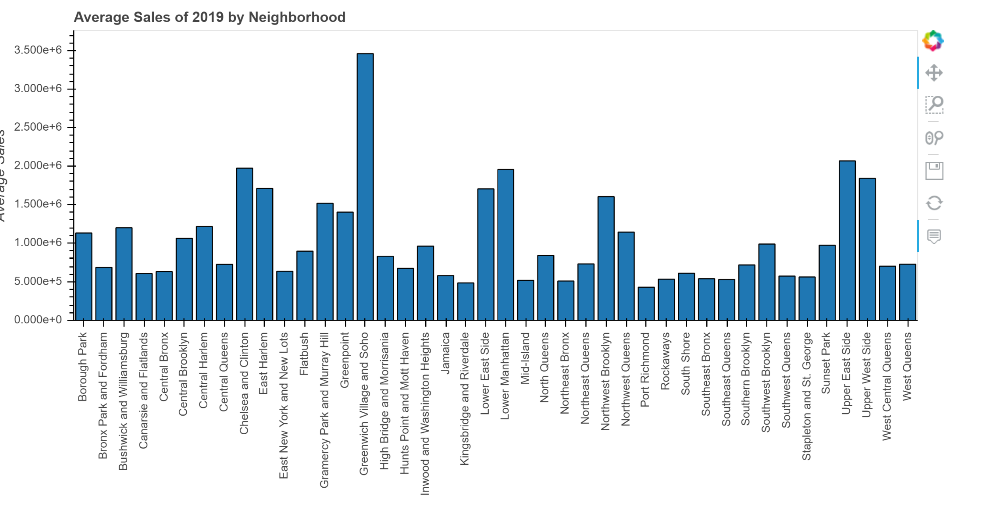

## MODEL FOR PREDICTING FUTURE PRICES FOR PROPERTIES AND RENT FOR THE NEXT 5 YRS
---
##### Montecarlo simulation for calculating the cumulative returns in property appreciation and Roi per rent 
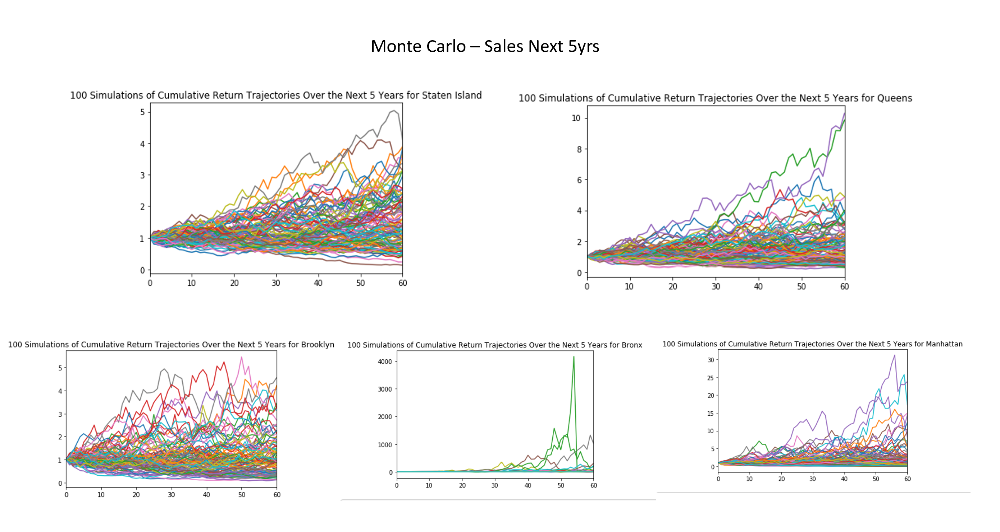
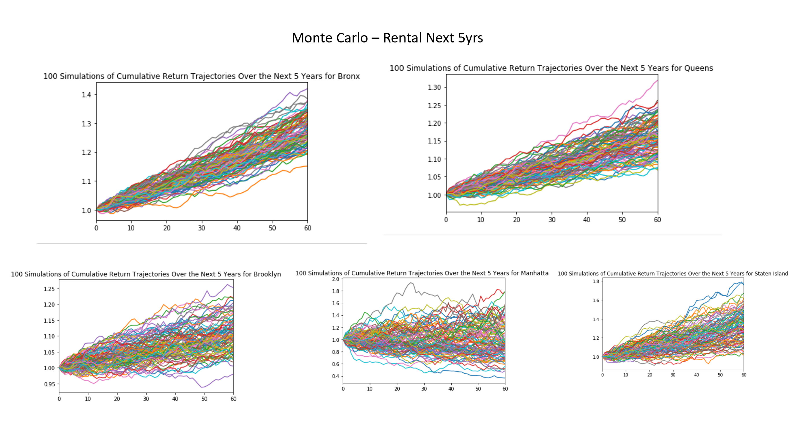
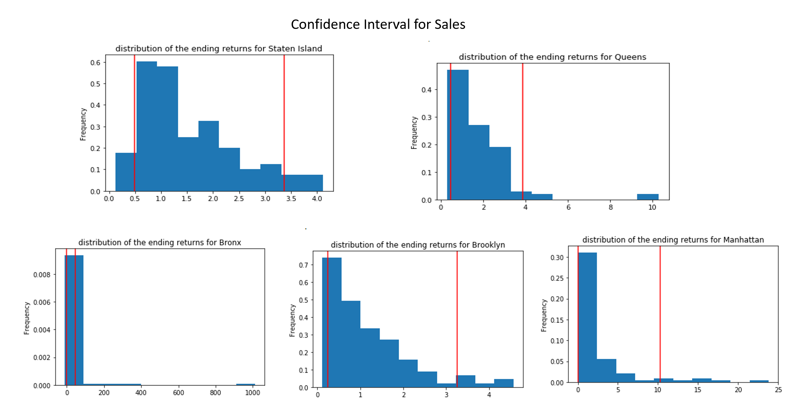
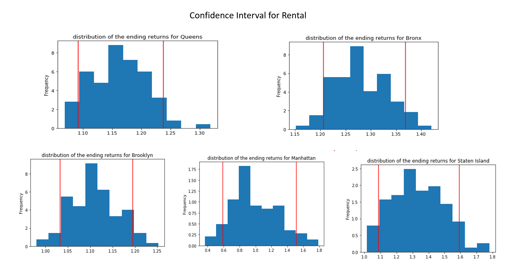

