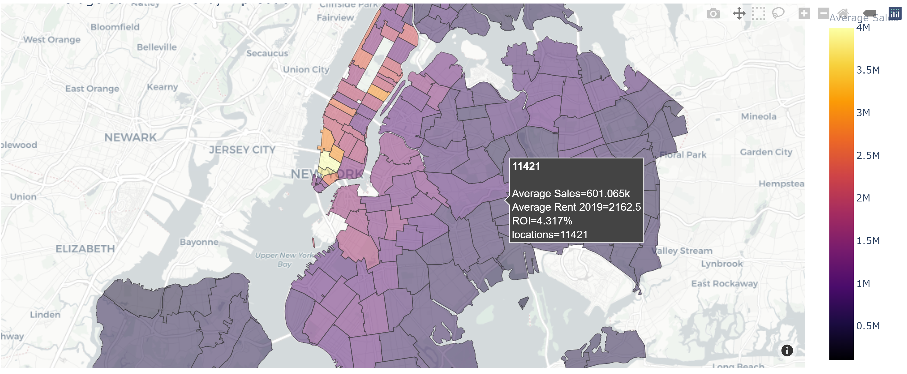
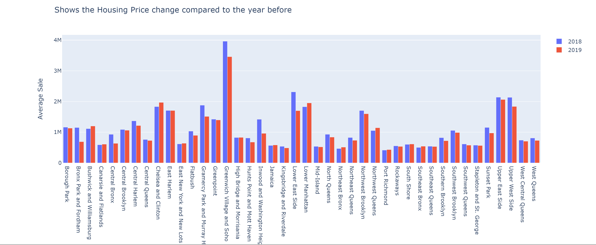
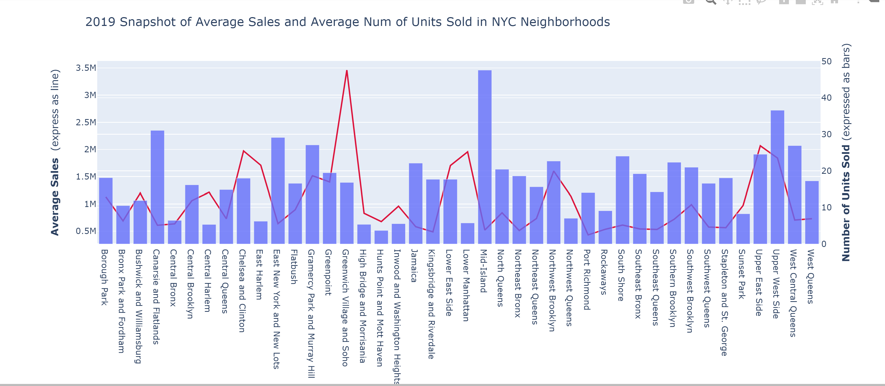

# project_01_fintech

### `TEAM MEMBERS`

`Shelly, Rachel, Shubhra, Kevin`
---

- Category - Fintech for Real Estate
- Objective - Investing in Real Estate in NYC Boroughs as an investment strategy

---
### `DATA SOURCES`

- Attom API - Historical Sales Data
- NYC Open Source - Data - GeoMapping, Zip to Neighborhood Mapping
- Zillow - Historical Rent Data
---

## `2019 TRENDS`
---

#### How to Calculate a Rental Property’s Return on Investment

##### Capitalization (cap) rate (ROI as refered to in the mapbox graph)

`In this project we didn't have to time to pull all the expenses so the ROI is just a demonstration of what we could do given more time`

Capitalization rate, also known as cap rate or ROI, refers to a property’s net income as a percentage of its market value. For the purposes of this calculation, the purchase price of the property is often used as its market value, especially if it was acquired within the past few years.

Cap rate can be useful for a few reasons. For starters, it could be an apples-to-apples way to compare potential rental properties that may have different financing structures, since it doesn’t take debt repayment into account. For example, if your lender wants a 15% down payment on a single-family property and a 25% down payment for a duplex, using the expected cap rate can help you determine which is the better deal relative to its rental income potential.

